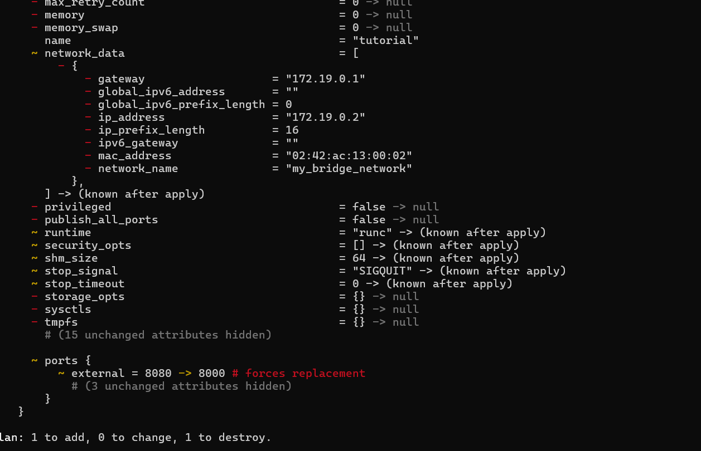
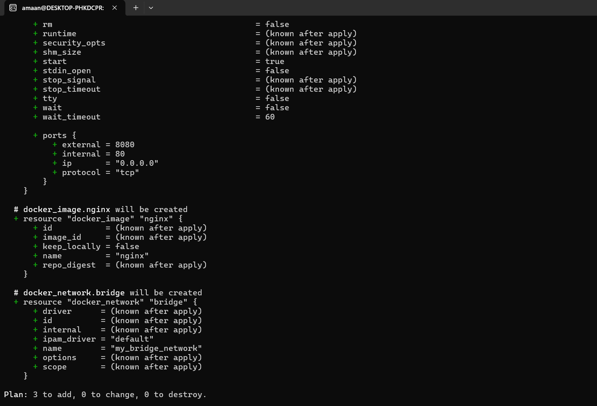

# Terraform Explaination
1. Install Terraform

2. Verify that it is installed

3. Terraform init

4. terraform apply

5. verify that in docker 

6. check that it opened the port

7. Made changes

8. terraform plan

9. terraform apply 

10. terraform destroy

11. Created resource with dependencies

